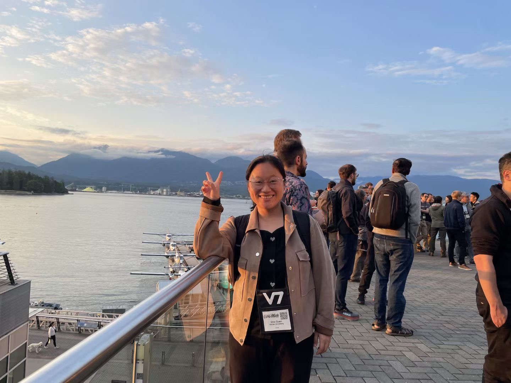

# Bio of Quan Dou (权豆)                               

 

  从2023年1月到现在，我就职于西安电子科技大学人工智能学院，任副教授。主要从事图像配准与变化检测相关研究工作。当前我的合作导师是[**焦李成**](http://www.liuyebin.com/)教授。我与清华大学**呼延宁**（博士后）保持良好合作关系，并共同开展相关研究工作。2019年11月到2020年11月曾在法国格勒诺布尔法国国家信息与自动化研究所访问交流，与[**jocelyn chanussot**](https://jocelyn-chanussot.net/)愉快合作。2011年到2022年在西安电子科技大学分别取得学士和博士学位。攻读博士期间主要跟随西安电子科技大学人工智能学院[**王爽**](https://web.xidian.edu.cn/shwang/)教授, 从事SAR图像配准相关研究工作。

## 研究兴趣:

SAR图像配准，变化检测，主要技术涉及深度学习，机器学习算法。

## 工作经历:

* 01/2023 - 至今:    副教授， 西安电子科技大学人工智能学院，陕西西安，中国。

* 06/2022 - 09/2011: 学士—博士， 西安电子科技大学，陕西西安，中国。

## 最新消息:

**Mar 2025:** 我们的文章 **123** 被 ***CVPR 2025***接收.

## 热点论文:
* Shuang Wang, **Dou Quan**, Xuefeng Liang, Mengdan Ning, Yanhe Guo, Licheng Jiao. **A deep learning framework for remote sensing image registration**. ISPRS Journal of Photogrammetry and Remote Sensing 145, 148-164.2018/11/1.
  

+ **Abstract:** We propose an effective deep neural network aiming at remote sensing image registration problem. Unlike conventional methods doing feature extraction and feature matching separately, we pair patches from sensed and reference images, and then learn the mapping directly between these patch-pairs and their matching labels for later registration. This end-to-end architecture allows us to optimize the whole processing (learning mapping function) through information feedback when training the network, which is lacking in conventional methods. In addition, to alleviate the small data issue of remote sensing images for training, our proposal introduces a self-learning by learning the mapping function using images and their transformed copies. Moreover, we apply a transfer learning to reduce the huge computation cost in the training stage. It does not only speed up our framework, but also get extra performance gains. The comprehensive experiments conducted on seven sets of remote sensing images, acquired by Radarsat, SPOT and Landsat, show that our proposal improves the registration accuracy up to 2.4–53.7%.
  [**PDF**](https://www.sciencedirect.com/science/article/pii/S0924271617303891) [**CODE**]()
  
* **Dou Quan**, Xuefeng Liang, Shuang Wang, Shaowei Wei, Yanfeng Li, Ning Huyan, Licheng Jiao. **AFD-Net: Aggregated feature difference learning for cross-spectral image patch matching**. Proceedings of the IEEE/CVF International Conference on Computer Vision(2019) 3017-3026.
  

 
+ **Abstract:** Image patch matching across different spectral domains is more challenging than in a single spectral domain. We consider the reason is twofold: 1. the weaker discriminative feature learned by conventional methods; 2. the significant appearance difference between two images domains. To tackle these problems, we propose an aggregated feature difference learning network (AFD-Net). Unlike other methods that merely rely on the high-level features, we find the feature differences in other levels also provide useful learning information. Thus, the multi-level feature differences are aggregated to enhance the discrimination. To make features invariant across different domains, we introduce a domain invariant feature extraction network based on instance normalization (IN). In order to optimize the AFD-Net, we borrow the large margin cosine loss which can minimize intra-class distance and maximize inter-class distance between matching and non-matching samples. Extensive experiments show that AFD-Net largely outperforms the state-of-the-arts on the cross-spectral dataset, meanwhile, demonstrates a considerable generalizability on a single spectral dataset.  [**PDF**](https://openaccess.thecvf.com/content_ICCV_2019/html/Quan_AFD-Net_Aggregated_Feature_Difference_Learning_for_Cross-Spectral_Image_Patch_Matching_ICCV_2019_paper.html) [**CODE**]()
  

## 奖项:

## 联系方式: 

**Email:** quandou@xidian.edu.cn， douquan.xidian@gmail.com

**Address:** Xi'an, Shannxi, China.

